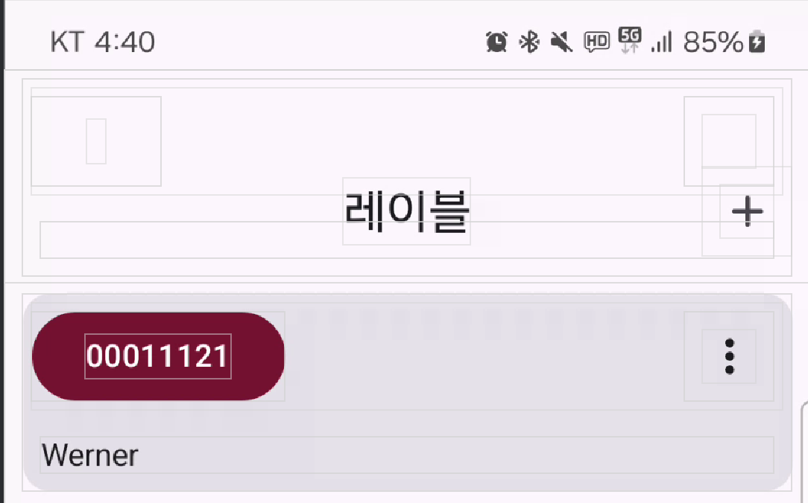
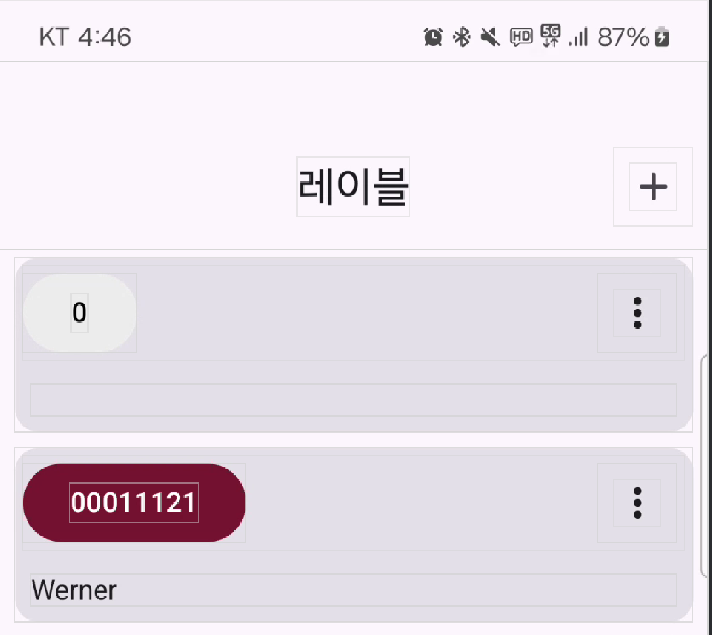
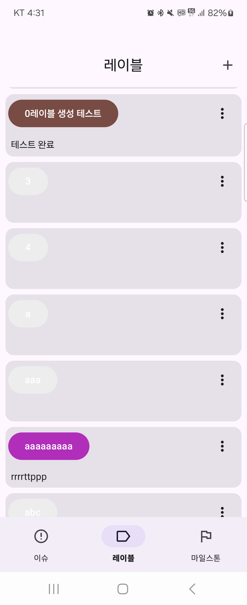
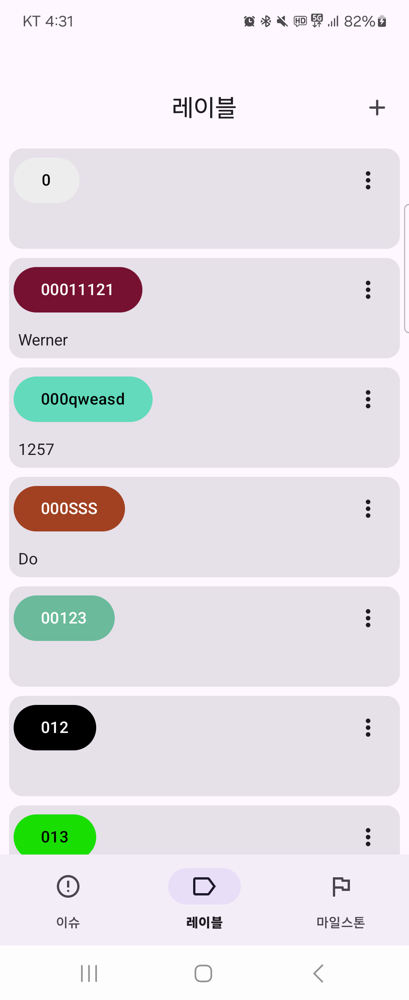
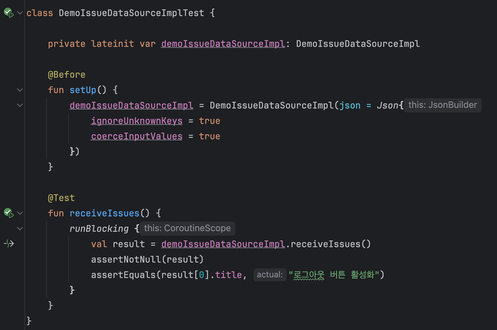

## 리팩토링

1. 레이블 화면 리팩토링
  - 레이블 리스트가 top bar의 top 위치가 동일하기 때문에 레이블 리스트의 첫 아이템이 top bar 아래에 가려지는 문제가 발생
  
    
    
  - top bar와 column 둘다 Scafold에 내부에 존재하며, Scafold의 마지막 인자에서 contentPadding을 제공하기 때문에 이를 이용해 column의 modifier의 padding의 top에 contentPadding값을 적용하여 해결했다.

    

  - 레이블 아이콘 버튼 내부의 텍스트를 흰색으로 동일하게 적용했기에, 레이블이 흰색에 가까운 경우 텍스트가 잘 보이지 않는 문제가 있었다.

    

  - luminance 함수를 버튼 컬러에 사용하여, 버튼 컬러의 밝기를 계산하여 이를 기준으로 텍스트 컬러를 결정하도록 구현했다.

    

2. Json 파일 Jvm Unit Test
  - Json 파일을 읽고 역직렬화한 데이터 클래스를 테스트 진행 과정
    - 첫번째로, JvmIssueUnitTest 클래스(object)를 통해 일반 디렉토리에 존재하는 json 파일에 접근하는 로직을 이용해 Json 파일을 inputStream으로 얻었다.
    - 두번째로, 테스트로 사용할 DemoIssueDataSource 객체를 UnitTest 클래스에서 생성했다. 이 때, 의존성 주입으로 context를 사용하여 안드로이드의 assets 디렉토리에 접근하는 인자 위치에 JvmIssueUnitTest 객체(싱글톤)을 사용했다.
    - 세번째로, DemoIssueDataSource 객체의 getIssueList 함수를 통해 json 파일을 역직렬화하고 그 데이터클래스의 데이터를 확인하는 테스트를 진행했다.
    - 테스트 결과

      

  - `*` 안드로이드에서 제공하는 assets 디렉토리는 context 없이는 접근 불가능하다. 
    - 그래서 context를 사용하는 인자를 사용할 수 없는 Jvm Unit Test에서는 assets 디렉토리에 접근할 수 없다. 
    - 그래서 일반 디렉토리에 json 파일을 넣어서 접근하는 방식을 사용했다.

3. base fragment 이름 수정
  - IssueBaseFragment 로 변경

4. adapter 전용 model 선언
   - adapter에서 각 아이템이 선택되었는지 여부를 저장하는 isSelected 변수를 포함한 model을 선언했다.
   - 이를 통해 adapter에서 선택된 아이템을 저장하고, 이를 통해 선택된 아이템을 다시 선택했을 때 선택을 해제하도록 구현했다.
   - Pair로 사용하는 대신 전용 Model을 사용함으로서 가독성을 높였다.

5. viewHolder 에서 bind 함수시 joinToString 연산 로직 수정
  - 리사이클러뷰 특성상 아래로 스크롤한 후 다시 되돌아오면, 이전에 joinToString로 연산했던 아이템의 text를 다시 bind에서 연산해야 한다.
  - 이를 해결하기 위해 4번과 같이 text 속성이 추가된 ListAdapter 전용 model을 사용하여, ListAdapter의 submitList 함수를 통해 전용 model 데이터를 전달하여 text를 띄우도록 구현했다.
  - 전용 model의 text 속성은 data class의 메서드로서 연산을 수행하도록 구현했다.